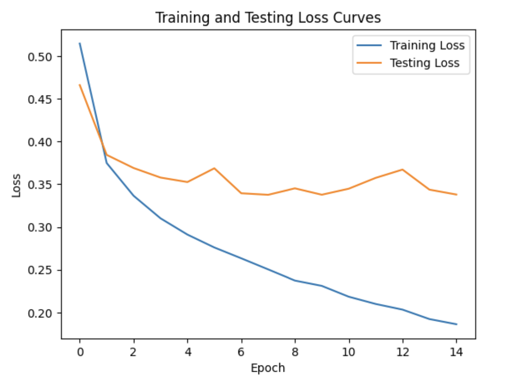
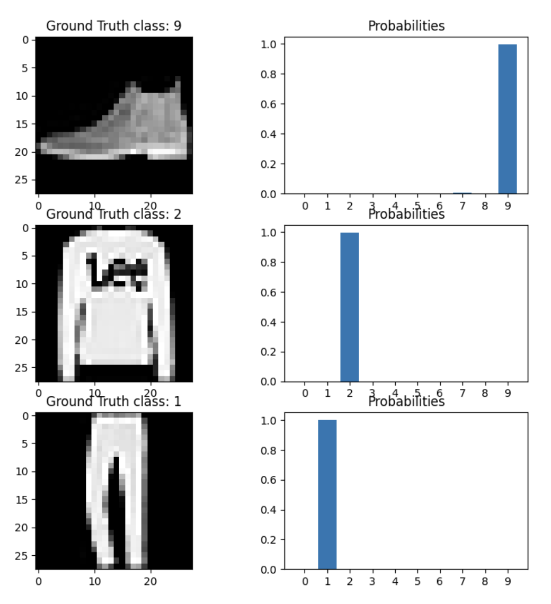

# DNN for fashionMNIST classifier

In this project we use a dense neural network with three (3) hidden layers with 256, 128, and 64 neurons respectively, all with ReLU activations to train a classifier for the fashionMNIST dataset. 

We visualize the train and test loss curves as below:

We can see that the test accuracies of the final model is 89.14%. 

We display 3 image samples from the test dataset with the predicted class probabilities for each sample:

As we can see, the model predicts the true label with high probability.

